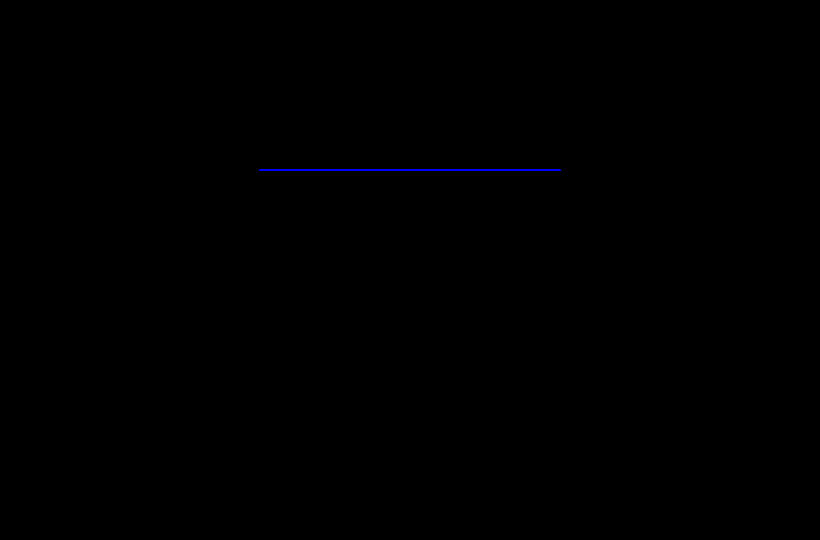
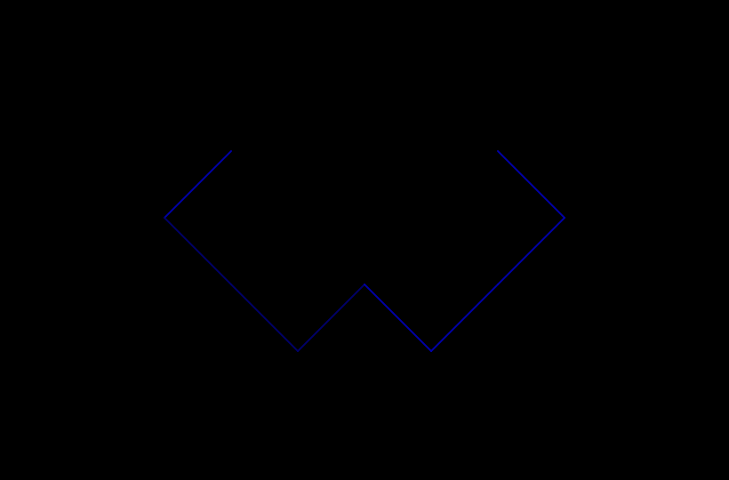
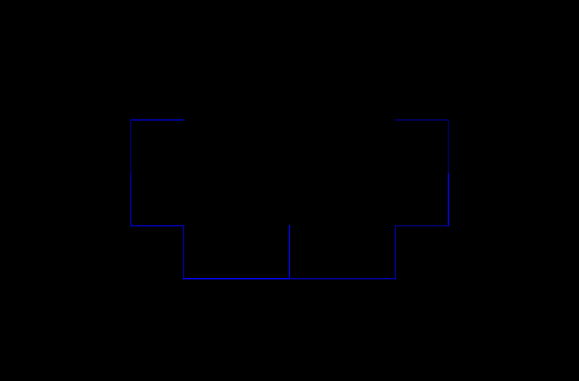
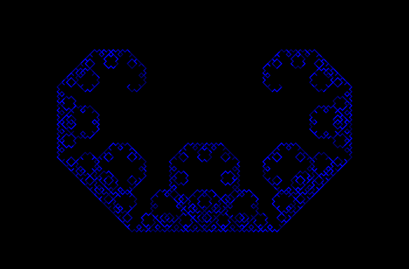
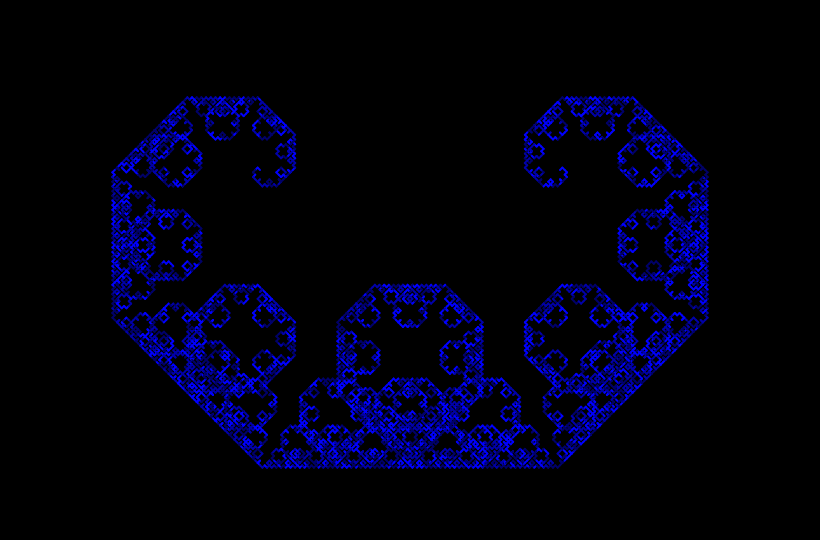
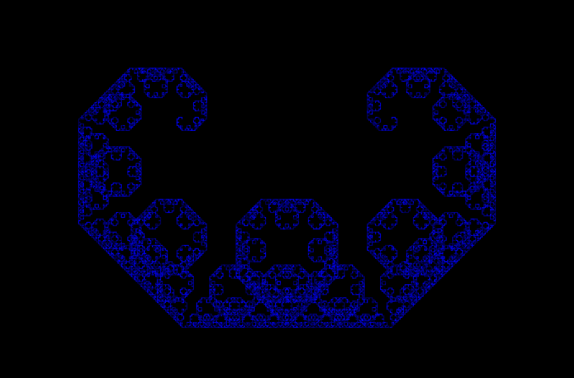

A simple Lévy C-Curve generator
===============================

Written in Javascript (with HTML5 Canvas).

The Lévy-C-Curve is also known as the Lévy dragon (a variant of the famous Dragon Curve Fractal).

Share and enjoy.
